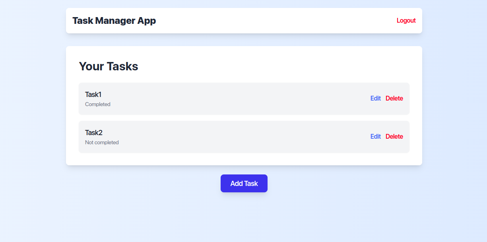
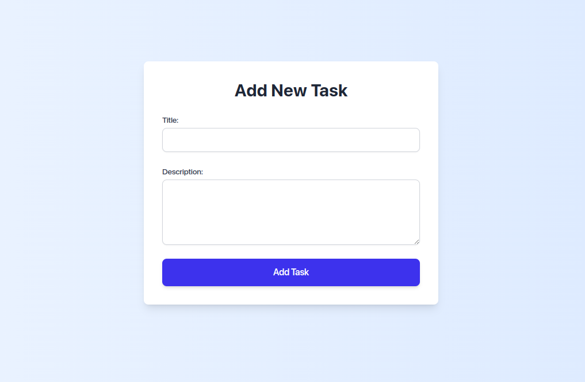
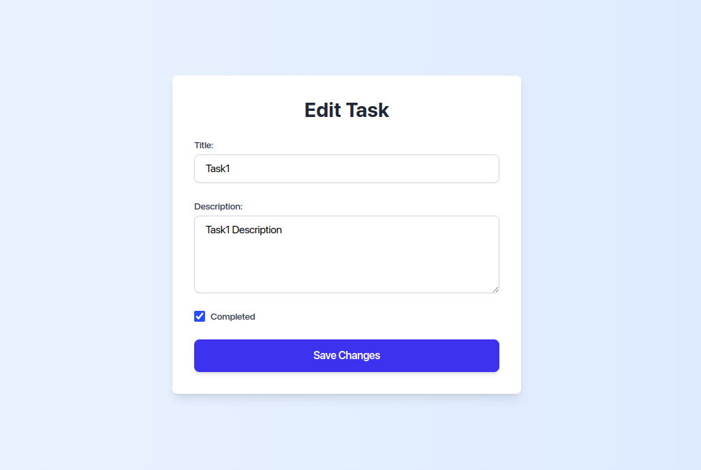
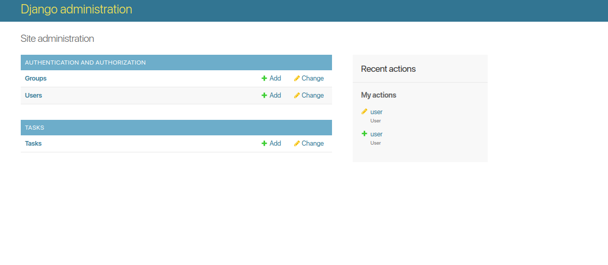

# Task Manager Application

A simple and modern task management system built using Django and Tailwind CSS. This application allows users to manage tasks with a sleek and intuitive UI.

## **Features**
- User authentication (login/logout).
- Add, edit, delete, and view tasks.
- Mark tasks as completed or not completed.
- Responsive design with Tailwind CSS.

---

## **Installation Guide**

### **1. Clone the Repository**
Clone this project to your local machine:
```bash
git clone https://github.com/your-repository-url.git
cd your-repository-folder
```

### **2. Set Up a Virtual Environment**
Create and activate a virtual environment:
```bash
python3 -m venv venv
source venv/bin/activate  # On Windows: venv\Scripts\activate
```

### **3. Install Dependencies**
Install the required Python libraries:
```bash
pip install django
```

### **4. Apply Migrations**
Set up the database:
```bash
python3 manage.py makemigrations
python3 manage.py migrate
```

### **5. Run the Server**
Start the development server:
```bash
python3 manage.py runserver
```

The application will be available at [http://127.0.0.1:8000](http://127.0.0.1:8000).

---

## **Access the Application**

### **Admin Access**
- **URL**: [http://127.0.0.1:8000/admin](http://127.0.0.1:8000/admin)
- **Username**: `admin`
- **Password**: `admin123`

### **User Access**
- **URL**: [http://127.0.0.1:8000/accounts/login/](http://127.0.0.1:8000/accounts/login/)
- **Username**: `user`
- **Password**: `user1234`

---

## **Screenshots**
1. **Task List Page**  


2. **Add Task Page**  


3. **Edit Task Page**  


4. **Admin Panel**  



---

## **License**
This project is licensed under the MIT License.
